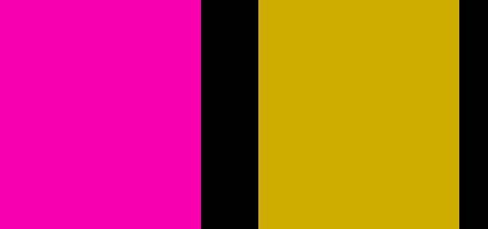
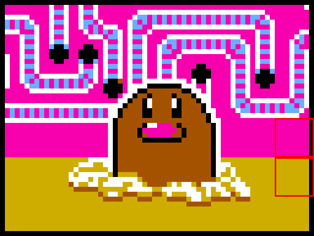
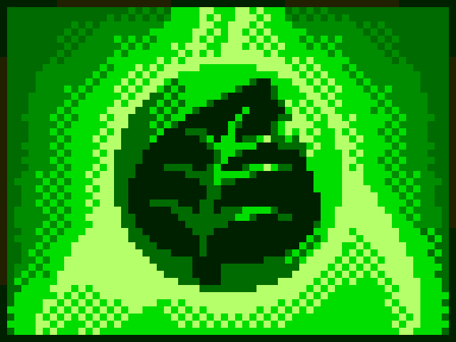
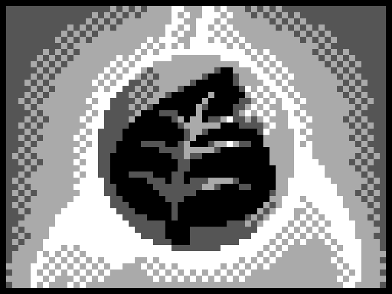
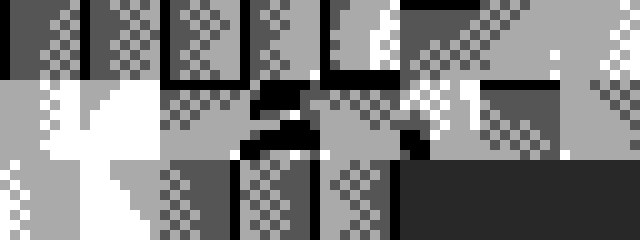
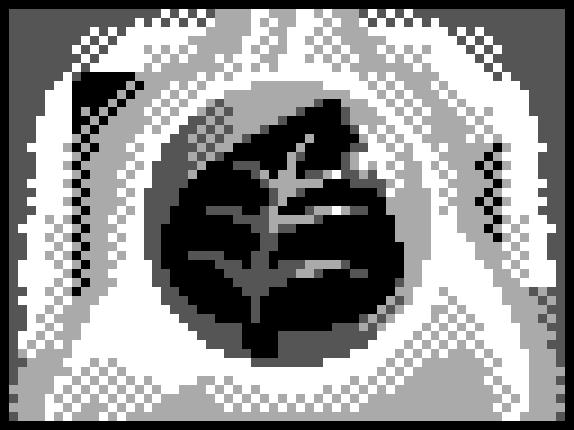
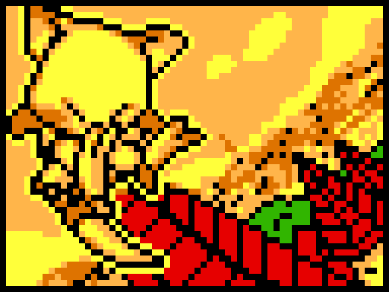
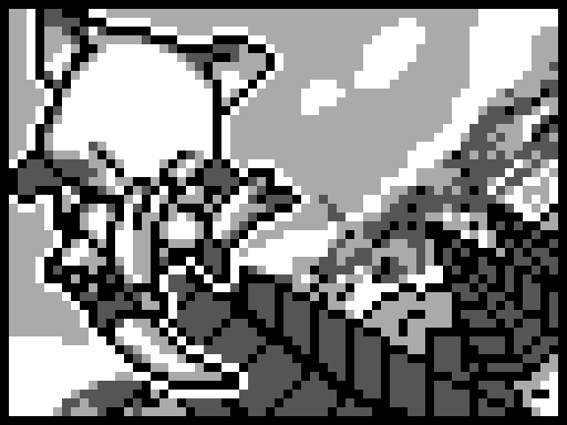

# Card portrait graphics

How a card's picture is stored, colored, found, and drawn — and what the per-card
`src/gfx/cards/<name>_extra.bin` files are for.

Every card has a small **8×6-tile (64×48 px) portrait**. Unlike a normal Game Boy
image it is a **multi-palette** picture (up to 12 colors), and it is drawn **two
ways** from the same bytes: in a duel the Game Boy Color tints each cell with one
of three palettes; the Game Boy Printer has no palettes, so it prints a flat
grayscale and needs a few pre-shaded extra tiles. This doc walks the whole path.

- [1. The tile format](#1-the-tile-format)
- [2. Color: the three-palette system](#2-color-the-three-palette-system)
- [3. Extra data after the portrait](#3-extra-data-after-the-portrait)
- [4. The per-card record (how it's stored)](#4-the-per-card-record-how-its-stored)
- [5. Finding a card's portrait (indexing)](#5-finding-a-cards-portrait-indexing)
- [6. ROM layout & how big a card can get](#6-rom-layout--how-big-a-card-can-get)
- [7. Drawing it: two renderers](#7-drawing-it-two-renderers)
- [8. Tile order vs cell order](#8-tile-order-vs-cell-order)
- [9. Why the extra tiles exist](#9-why-the-extra-tiles-exist)
- [10. Does it reuse tiles? Rarely.](#10-does-it-reuse-tiles-rarely)
- [11. Worked example — Grass Energy](#11-worked-example--grass-energy-21-extra-tiles)
- [12. Contrast — a card with no extra](#12-contrast--a-card-with-no-extra-tiles-abra)
- [13. Representing the files](#13-representing-the-files)
- [14. Comparison to tcg1](#14-comparison-to-tcg1)

---

## 1. The tile format

A portrait is **48 tiles** in an 8-wide × 6-tall grid, stored as standard Game Boy
**2bpp** graphics — exactly what `src/gfx/cards/<name>.2bpp` holds (built from
`<name>.png`). Every card is the same size: **768 bytes = 48 × 16**.

Each 16-byte tile is 8 rows × 2 bytes; row `r` is bytes `2r` (bitplane 0) and
`2r+1` (bitplane 1), interleaved. A pixel is two bits — `value = (plane1 << 1) |
plane0` — giving a **2-bit index 0–3** (leftmost pixel = bit 7):

```
plane0 = 0xC9 = 1 1 0 0 1 0 0 1
plane1 = 0xF1 = 1 1 1 1 0 0 0 1
pixels =        3 3 2 2 1 0 0 3      ← (plane1<<1)|plane0 per column
```

The `.2bpp`/`.png` is **grayscale** — it only stores the *shape* (which of 4
shades each pixel is). The actual colors come from the palettes, applied when the
card is drawn (next section). Tiles are stored **column-major** (`rgbgfx -Z`): tile
`k` belongs at grid column `k // 6`, row `k % 6`.

---

## 2. Color: the three-palette system

A normal Game Boy image has **one** palette (4 colors). A poketcg2 card carries
**three** GBC palettes plus a **per-cell selector**, so different 8×8 cells can use
different palettes — up to **12 colors** on one card, even though every individual
tile is still only 4 colors.

The selector is a **48-byte attribute map** (one byte per cell). Each byte packs
two unrelated fields:

```
 bit  7 6 | 5 4 3 2 1 0
      pal | tile-redirect offset (0..63)
```
- **high 2 bits** — which of the 3 palettes colors this cell (used when drawn in a duel)
- **low 6 bits** — a tile-redirect offset (used only by the printer; see [§9](#9-why-the-extra-tiles-exist))

So a card's color is `grayscale tiles` × `3 palettes` × `per-cell palette choice`.
On the Game Boy Color this is free: every background tile already has an attribute
byte selecting its palette, and the game just writes `attr[cell] >> 6` into the
BG attribute map — the hardware recolors each cell. The portrait `.png` stays a
plain 4-shade grayscale; the palettes live in the card header as `rgb` directives.

This is the headline difference from the original game ([§14](#14-comparison-to-tcg1)):
tcg1 cards are single-palette (4 colors); poketcg2 added the 3-palette + attribute
map so cards can be more colorful.

---

## 3. Extra data after the portrait

A card's graphics don't necessarily stop at the 48 portrait tiles. **Many cards
have a little extra tile data appended right after** the 768-byte portrait —
anywhere from 16 bytes (1 tile) to 768 bytes (48 tiles). Roughly **191 of 445**
cards carry some; the other 254 stop at the portrait.

This trailing data is used **only by the Game Boy Printer**, never by the in-duel
display, and it lives in `src/gfx/cards/<name>_extra.bin`. For now just keep in
mind that a card's record is the 48-tile portrait *plus*, for many cards, a few
more tiles tacked on the end — that's why the storage layout below has an
"extra tiles" row. [§9](#9-why-the-extra-tiles-exist) explains what they're for
and why they exist.

---

## 4. The per-card record (how it's stored)

Each card's graphics are one fixed-shaped record: a **72-byte header + 768-byte
portrait + N extra tiles**.

| Part | Size | Contents |
|---|---|---|
| Palettes | 24 B | 3 GBC palettes (4 colors × 2 bytes each) |
| Attribute map | 48 B | one byte per cell (palette + redirect) — see §2 |
| Portrait tiles | 768 B | the 48 grayscale tiles → `<name>.2bpp` |
| Extra tiles | N×16 B | printer-only tiles → `<name>_extra.bin` (often absent) |

`CARD_TILE_COUNT = $30 = 48` is a **constant** — the portrait and the attribute map
are this size for *every* card; there is no per-card "tile count" field. Only the
extra-tile count `N` varies, and it isn't stored anywhere ([§6](#6-rom-layout--how-big-a-card-can-get)).

In source ([src/gfx/card_graphics.asm](../src/gfx/card_graphics.asm)) a card is the
3 palettes as `rgb`, the attribute map as `db`, then
`<Name>CardGfx:: INCBIN "<name>.2bpp"`, immediately followed (when `N > 0`) by
`<Name>CardGfxExtra:: INCBIN "<name>_extra.bin"`. The portrait tiles and the extra
tiles together form **one tile pool** (tiles 0..47 are the portrait, 48.. are the
extra), which the attribute map indexes into.

Note there is **no tile dedup** in the portrait: every cell gets its own stored
tile even when two are byte-identical, so a card always stores 48 tiles
([§10](#10-does-it-reuse-tiles-rarely)).

---

## 5. Finding a card's portrait (indexing)

The graphics records are **variable-length** (the extra tiles make each card a
different size), so you can't jump to "card N" by multiplying. The data isn't what
you index — a fixed-stride table of **pointers** is. There are two levels, and
**nothing is ever iterated**:

**Level 1 — `CardPointers`** ([src/data/card_pointers.asm](../src/data/card_pointers.asm)):
a flat array of 2-byte pointers, one per card ID. `GetCardPointer`
([src/home/card_data.asm](../src/home/card_data.asm)) is the O(1) lookup:

```
de = card ID
hl = de * 2
hl += CardPointers          ; &CardPointers[id]
read the 2-byte pointer      ; -> this card's (variable-length) data record
```

A pointer table is needed here because the **data records themselves are
variable-length** by card type: Pokémon = `$42` (66 B), Trainer/Energy = `$0d`
(13 B). `id × fixed_size` can't work.

**Level 2 — the `gfx` field**: each card's data record embeds a precomputed pointer
into the graphics blob:

```
gfx index = (<Name>CardGfx − CardGraphics) / 8
```

[`LoadCardGfx`](../src/home/card_data.asm) turns that into a bank + address with
pure arithmetic. So drawing card #N is all O(1):

1. `CardPointers[N]` → data record (one `id*2` index into the pointer table)
2. read the record's `gfx` field → the gfx pointer
3. `LoadCardGfx(gfx)` → bank/address math → the tiles

Two details make the 2-byte pointers reach far enough:
- The gfx pointer is stored as **offset ÷ 8**, so a 16-bit value can address the
  multi-bank (> 64 KB) `CardGraphics` region — which works *because* every card
  graphics record is **8-byte aligned** (the inter-card strides are all multiples
  of 8).
- `CardPointers` entries are **bank-relative** (the `card_ptr` macro bakes in the
  bank offset), so a 2-byte pointer addresses records spread across banks.

This is the classic answer to "variable-length array, random access needed": put a
fixed-size index/pointer table in front of it. Here it's done twice — once for card
data (`CardPointers`), once for graphics (the embedded `gfx` field).

---

## 6. ROM layout & how big a card can get

Because the records are variable-length, the cards are **packed tight, not on a
fixed grid**. Measuring the byte distance between consecutive `CardGfx` records:

| interval | count | = header + portrait + extra |
|---|---|---|
| **840** | 240 | 72 + 768 + **0** (cards with no extra) |
| 856 | 17 | 840 + **16** (1 extra tile) |
| 872 | 20 | 840 + **32** (2 tiles) |
| 888 | 23 | 840 + **48** (3 tiles) |
| 904 / 936 / 952 … | | 840 + N×16 (+ occasional padding) |

So a record is `72 + 768 + N×16` (+ a little padding), and a card's extra tiles
physically push the next card later in ROM.

**How big can `N` get? At most 48.** The printer produces exactly **48 output
cells**, and each cell references **one** source tile — so the extra pool can never
need more than **48 tiles** (one per cell). `N = 48` is the meaningful maximum: the
case where *every* output cell is a baked tile and the printer reuses none of the
original portrait. That bound is real — **four cards hit it exactly** (768 B:
`pikachu_lv16`, `machoke_lv28`, `magmar_lv18`, `nidoran_f_lv12`), and no card has
more.

(The 6-bit redirect field is only a looser ceiling: `offset ≤ 63` plus `c ≤ 47`
allows a source index up to `110`, i.e. up to 63 tiles — but going past 48 would
mean storing *unreferenced filler* tiles just to reach a far one, which is
pointless, so it never happens. The packer assigns the extra indices densely
starting at 48, keeping `N` = the number of baked tiles actually needed.)

`N` is **derived** from the attribute map (`max((attr[c] & 0x3f) + c) − 47`), not
stored — the game never needs it, and the decomp computes it only to know where to
split each card's bytes into `.2bpp` + `_extra.bin`.

---

## 7. Drawing it: two renderers

The same record is drawn two ways.

**In a duel** — [`LoadCardGfx`](../src/home/card_data.asm) copies the 48 portrait
tiles **1:1** into VRAM, and [`CopyCGBCardPalette`](../src/engine/bank01.asm) turns
each attribute byte's **high 2 bits** into a CGB background-palette attribute. So
cell `c` shows **portrait tile `c`, recolored by hardware** with palette
`attr[c] >> 6`. The redirect offset and the extra tiles are never touched.

**On the printer** — [`LoadCardGfxRemapped`](../src/home/card_data.asm) reconstructs
the 48 tiles using the **low 6 bits**:

```
printer output tile c  =  source tile  (attr[c] & 0x3f) + c
```

When that index exceeds 47 it reaches into the **extra** region.
[`BuildPrintableCardPic`](../src/engine/bank06.asm) then repacks each tile's raw
2-bpp pixels (with a 2× upscale) into the print buffer and — per its own source
comment — *"The per-tile palette is dropped, so the printout is a flat grayscale
of the card."*

---

## 8. Tile order vs cell order

The stored tiles are **column-major** (`rgbgfx -Z`): tile `k` belongs at screen
column `k // 6`, row `k % 6`. The in-duel BG is filled **row-major** through a
reorder table ([`DrawLoadedCard.CardTilemap`](../src/engine/bank04.asm)), and the
attribute map is copied straight onto it — so a cell's **palette** is read
**row-major** by screen cell (`attr[row*8 + col]`), while its **tile** and the
printer's **redirect** are **column-major** (`attr[col*6 + row]`). The 48 attribute
bytes are just 48 bytes; the two renderers walk them in different orders, and the
data is authored so both produce the right picture. (Getting this transpose wrong
keeps the card's *shape* but scrambles its *colors* — an easy mistake when
reconstructing the image off-hardware.)

---

## 9. Why the extra tiles exist

It comes from **per-cell color**, and the fact that the **printer has no palettes.**

Per [§2](#2-color-the-three-palette-system), each cell can use a different palette,
so a card has up to 12 colors. The **printer drops the palettes** and prints the
raw 2-bit pixel values as fixed grays. So a cell whose color came from palette 1 or
2 would print as if it were palette 0 — wrong shade. To reproduce the card in flat
gray, each such cell needs a tile whose pixels *already* encode the right shade
(the chosen palette's luminance, baked in). Those baked variants are the `_extra`
tiles, and the redirect offset sends each printer cell to its correct pre-shaded
tile (identity when the portrait tile already prints correctly, or an offset into
the extra pool when it does not).

> **`_extra.bin` = the per-cell, palette-baked tile variants the grayscale printer
> needs that don't already exist among the 48 portrait tiles.**

Energy cards have the biggest extras (Grass = 21 tiles) precisely because their art
uses the most per-cell palette variation, so the most cells need baking.

---

## 10. Does it reuse tiles? Rarely.

It's tempting to assume the 3-palette system is for *tile dedup* — store one shape,
recolor it in several places. **Auditing all 445 cards, that barely happens.** Only
**7** cards show any byte-identical tile in more than one palette, and **6 of those
are blank background tiles** where the palette doesn't change the look at all. Just
**2 cards** (`diglett_lv16`, `rainbow_energy`) reuse a *visible* tile in genuinely
different colors — and even those are flat color blocks, not detailed art.

Here is the clearest one. Diglett reuses a single flat background tile as both the
**magenta wall** and the **olive floor** (the two outlined cells), by pointing them
at different palettes:

| The one tile, in its two palettes | …placed on the card (outlined) |
|---|---|
|  |  |

So the takeaway: poketcg2's tiles are essentially **all distinct**; the 3 palettes
add **per-cell color**, not shape reuse. The `_extra.bin` tiles exist for that
per-cell color (baking it for the printer), not for dedup.

---

## 11. Worked example — Grass Energy (21 extra tiles)

**In a duel** (CGB, portrait tiles recolored by palette) vs **on the printer**
(flat grayscale, remapped through the extra tiles):

| In-duel (CGB color) | Printer (flat gray, remapped) |
|---|---|
|  |  |

The printer reproduces the same leaf in 4 grays. It can only do that because of
the extra tiles — here are all 21 of them (a *tile pool*, not a coherent picture):



To see *why* they're needed, compare the printer's correct output (above) with a
**naïve** render that uses only the stored portrait tiles, flat, with no remap —
i.e. what you'd print if you ignored `_extra.bin`:

| Naïve: portrait tiles, flat gray, no remap | Correct: remapped through extra tiles |
|---|---|
|  |  |

21 of the 48 cells differ — look at the top-left corner and the outer halo, the
regions the in-duel display recolored via palette. Those are exactly the cells
(column-major index `c`) whose `attr` low-bits redirect the printer into the extra
pool:

| cell `c` | `attr[c]` | offset (`& $3f`) | source tile = offset + `c` |
|---|---|---|---|
| 0 | `$00` | 0 | 0 (portrait) |
| 1 | `$6f` | 47 | **48 (extra 0)** |
| 2 | `$6f` | 47 | **49 (extra 1)** |
| … | | | |
| 11 | `$00` | 0 | 11 (portrait) |
| 26 | `$21` | 33 | **59 (extra 11)** |
| 45 | `$17` | 23 | **68 (extra 20)** |

Redirected cells for Grass Energy: `1–10, 12, 26, 30, 32, 36–39, 43–45` → 21
extra tiles → 336 bytes. (Tile count `N = max((attr[c] & 0x3f) + c) − 47`.)
The byte's *high* bits aren't shown here — they're the palette, and as noted in
[§8](#8-tile-order-vs-cell-order) the in-duel renderer reads them in a different
(row-major) order.

---

## 12. Contrast — a card with **no** extra tiles (Abra)

Most cards (254 of 445) have an all-identity attribute map: the printer render is
the portrait, recolored, with no redirects — so there is no `_extra.bin` at all.
The in-duel color and the printer gray come from the **same 48 portrait tiles**:

| Abra in-duel (CGB color) | Abra printer (flat gray) |
|---|---|
|  |  |

Charmander sits between the two — just 3 extra tiles (cells 33, 39, 45):


---

## 13. Representing the files

- The portrait `.2bpp` and `_extra.bin` are **one logical tile array** indexed by
  the header. The extra is *not* a spatial extension of the portrait and *not* a
  separate picture — it's just more tiles of the same pool, used only by the
  printer path.
- There is **no single bigger image** to reconstruct: both renders are 8×6. The
  closest thing to "the full picture" is the printer's flat-gray render, which is
  a *derived* artifact (apply the remap, drop palettes); reversing it back to the
  exact stored bytes is not lossless, so it can't be a build input.
- Faithful representations, cleanest first:
  1. **`<name>_extra.png`** (grayscale tile-strip) — byte-exact, mirrors the
     portrait pipeline; "it's just more tiles." (Looks like a fragment sheet,
     because that's what it is.)
  2. **One combined tile-array `.2bpp`** with `CardGfx` / `CardGfxExtra` as two
     `INCBIN …, offset` labels — possible but needs a concat step (the portrait's
     column-major `-Z` geometry can't absorb N extra tiles in one rectangular PNG).
  3. **A non-build debug viewer** (this doc's renderer) that produces the in-duel
     color image and the printer gray image per card — best for *seeing* a card,
     but a viewer, not source.

---

## 14. Comparison to tcg1

The original Pokémon TCG GB (`pret/poketcg`, "tcg1") has **none** of the color or
printer-remap machinery — no second/third palette, no attribute map, no
`LoadCardGfxRemapped`, and no `_extra.bin`. The whole multi-palette card system is
new in poketcg2.

The reason is the palette count. A tcg1 card is **768 bytes (48 tiles) + one 8-byte
palette** (a separate `<name>.pal` file, 4 colors). With a **single palette**, no
cell needs a different color, so the 48 portrait tiles *are* the whole picture, 1:1
— and tcg1's Game Boy Printer (same `_RequestToPrintCard` /
`.DrawCardPicInSRAMGfxBuffer2` engine) just prints those tiles directly: 4 pixel
values → 4 grays, nothing to undo.

| | tcg1 | poketcg2 |
|---|---|---|
| palettes per card | 1 (separate `.pal`) | 3 (in the asm header) |
| per-cell attribute map | none | 48 bytes (palette + redirect) |
| colors per card | 4 | up to 12 |
| portrait tiles | 48, = the whole image | 48, but cells can be recolored / redirected |
| printer path | `LoadCardGfx` → tiles printed directly | `LoadCardGfxRemapped` → pulls extra tiles |
| extra tiles | — | `_extra.bin` (palette-baked variants) |
| header layout | `[tiles][1 palette]` | `[3 palettes + 48 attr][tiles]` |

So if you ever wonder "why isn't this just a `.png` like tcg1's cards?" — it's
because tcg1's cards genuinely *are* single-palette images, while a poketcg2 card
is a multi-palette image plus a printer-only tile pool.

---

## Regenerating these images

[tools/render_card_gfx_doc.py](../tools/render_card_gfx_doc.py) reads the real
source (palettes + attribute map from `card_graphics.asm`, tiles from `.2bpp` +
`_extra.bin`) and renders the in-duel color, naïve-gray, printer-gray, extra-tile,
and tile-reuse images into `docs/img/`. It is documentation tooling only — it does
not touch the build.

```sh
python3 tools/render_card_gfx_doc.py
```
